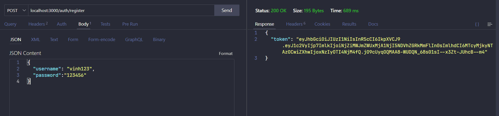

## Add Authentication

To add authentication to our Node.js API, we will use JWT (JSON Web Tokens) for token-based authentication. Here's a step-by-step guide to update the project with authentication features.

### Step 1: Install Required Packages

First, install the necessary packages for authentication:

```bash
npm install bcryptjs jsonwebtoken express-validator
```

### Step 2: Create User Model

Add a `User` model to handle user data and authentication.**models/user.js**

```javascript
const mongoose = require("mongoose");
const bcrypt = require("bcryptjs");

const userSchema = new mongoose.Schema({
  username: {
    type: String,
    required: true,
    unique: true,
  },
  password: {
    type: String,
    required: true,
  },
});

// Hash password before saving the user
userSchema.pre("save", async function (next) {
  if (!this.isModified("password")) {
    return next();
  }
  const salt = await bcrypt.genSalt(10);
  this.password = await bcrypt.hash(this.password, salt);
  next();
});

// Compare input password with the hashed password in the database
userSchema.methods.matchPassword = async function (password) {
  return await bcrypt.compare(password, this.password);
};

const User = mongoose.model("User", userSchema);

module.exports = User;
```

### Step 3: Create Authentication Controller

Create a controller to handle user registration, login, and authentication.
**controllers/authController.js**

```javascript
const User = require("../models/user");
const jwt = require("jsonwebtoken");
const { validationResult } = require("express-validator");

exports.registerUser = async (req, res) => {
  const errors = validationResult(req);
  if (!errors.isEmpty()) {
    return res.status(400).json({ errors: errors.array() });
  }

  const { username, password } = req.body;

  try {
    let user = await User.findOne({ username });

    if (user) {
      return res.status(400).json({ msg: "User already exists" });
    }

    user = new User({ username, password });

    await user.save();

    const payload = {
      user: {
        id: user.id,
      },
    };

    jwt.sign(payload, "secret", { expiresIn: "1h" }, (err, token) => {
      if (err) throw err;
      res.json({ token });
    });
  } catch (err) {
    console.error(err.message);
    res.status(500).send("Server error");
  }
};

exports.loginUser = async (req, res) => {
  const errors = validationResult(req);
  if (!errors.isEmpty()) {
    return res.status(400).json({ errors: errors.array() });
  }

  const { username, password } = req.body;

  try {
    let user = await User.findOne({ username });

    if (!user) {
      return res.status(400).json({ msg: "Invalid Credentials" });
    }

    const isMatch = await user.matchPassword(password);

    if (!isMatch) {
      return res.status(400).json({ msg: "Invalid Credentials" });
    }

    const payload = {
      user: {
        id: user.id,
      },
    };

    jwt.sign(payload, "secret", { expiresIn: "1h" }, (err, token) => {
      if (err) throw err;
      res.json({ token });
    });
  } catch (err) {
    console.error(err.message);
    res.status(500).send("Server error");
  }
};

exports.getUser = async (req, res) => {
  try {
    const user = await User.findById(req.user.id).select("-password");
    res.json(user);
  } catch (err) {
    console.error(err.message);
    res.status(500).send("Server error");
  }
};
```

### Step 4: Create Authentication Middleware

Create a middleware to protect routes that require authentication.
**middleware/auth.js**

```javascript
const jwt = require("jsonwebtoken");

module.exports = function (req, res, next) {
  const token = req.header("x-auth-token");

  if (!token) {
    return res.status(401).json({ msg: "No token, authorization denied" });
  }

  try {
    const decoded = jwt.verify(token, "secret");
    req.user = decoded.user;
    next();
  } catch (err) {
    res.status(401).json({ msg: "Token is not valid" });
  }
};
```

### Step 5: Create Authentication Routes

Create routes for user registration and login.
**routes/authRoutes.js**

```javascript
const express = require("express");
const router = express.Router();
const { check } = require("express-validator");
const authController = require("../controllers/authController");
const auth = require("../middleware/auth");

router.post(
  "/register",
  [
    check("username", "Username is required").not().isEmpty(),
    check("password", "Password is required").isLength({ min: 6 }),
  ],
  authController.registerUser
);

router.post(
  "/login",
  [
    check("username", "Username is required").not().isEmpty(),
    check("password", "Password is required").exists(),
  ],
  authController.loginUser
);

router.get("/", auth, authController.getUser);

module.exports = router;
```

### Step 6: Protect Product and Category Routes

Update the product and category routes to require authentication.
**routes/productRoutes.js**

```javascript
const express = require("express");
const router = express.Router();
const productController = require("../controllers/productController");
const auth = require("../middleware/auth");

router.get("/", auth, productController.getAllProducts);
router.get("/:id", auth, productController.getProductById);
router.post("/", auth, productController.createProduct);
router.put("/:id", auth, productController.updateProduct);
router.delete("/:id", auth, productController.deleteProduct);

module.exports = router;
```

**routes/categoryRoutes.js**

```javascript
const express = require("express");
const router = express.Router();
const categoryController = require("../controllers/categoryController");
const auth = require("../middleware/auth");

router.get("/", auth, categoryController.getAllCategories);
router.get("/:id", auth, categoryController.getCategoryById);
router.post("/", auth, categoryController.createCategory);
router.put("/:id", auth, categoryController.updateCategory);
router.delete("/:id", auth, categoryController.deleteCategory);

module.exports = router;
```

### Step 7: Update Main Application File

Update the main application file to use the authentication routes.
**app.js**

```javascript
const express = require("express");
const bodyParser = require("body-parser");
const productRoutes = require("./routes/productRoutes");
const categoryRoutes = require("./routes/categoryRoutes");
const authRoutes = require("./routes/authRoutes");
const connectDB = require("./db");

const app = express();

connectDB(); // Connect to MongoDB

app.use(bodyParser.json());

app.use("/products", productRoutes);
app.use("/categories", categoryRoutes);
app.use("/auth", authRoutes);

module.exports = app;
```

### Step 8: Run the Application

Start the server:

```bash
node server.js
```



### Summary

You have now added authentication to your Node.js API using JWT. Users can register, login, and access protected routes. Only authenticated users can perform CRUD operations on products and categories.
