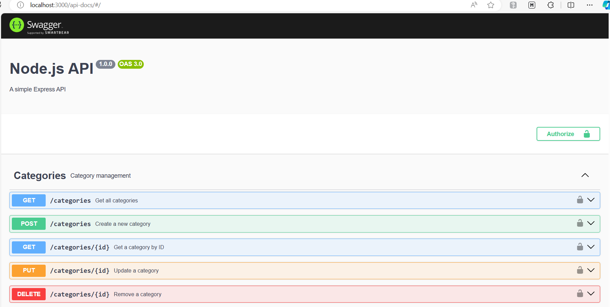

## Add Swagger for API Documentation

Adding Swagger to your Node.js API provides interactive API documentation and testing capabilities. You can use the `swagger-ui-express` and `swagger-jsdoc` packages to set up Swagger in your application. Here's how to do it:

### Step 1: Install Swagger Packages

First, install the necessary Swagger packages:

```bash
npm install swagger-ui-express swagger-jsdoc
```

### Step 2: Configure Swagger

Create a Swagger configuration file to define your API documentation.
**swagger.js**

```javascript
const swaggerJSDoc = require("swagger-jsdoc");

const options = {
  definition: {
    openapi: "3.0.0",
    info: {
      title: "Node.js API",
      version: "1.0.0",
      description: "A simple Express API",
    },
    components: {
      securitySchemes: {
        bearerAuth: {
          type: "http",
          scheme: "bearer",
          bearerFormat: "JWT",
        },
      },
    },
    security: [
      {
        bearerAuth: [],
      },
    ],
  },
  apis: ["./routes/*.js"], // Path to the API docs
};

const swaggerSpec = swaggerJSDoc(options);

module.exports = swaggerSpec;
```

### Step 3: Set Up Swagger UI

Update your main application file to serve the Swagger UI.
**app.js**

```javascript
const express = require("express");
const bodyParser = require("body-parser");
const cors = require("cors");
const rateLimit = require("express-rate-limit");
const swaggerUi = require("swagger-ui-express");
const swaggerSpec = require("./swagger");
const productRoutes = require("./routes/productRoutes");
const categoryRoutes = require("./routes/categoryRoutes");
const authRoutes = require("./routes/authRoutes");
const connectDB = require("./db");

const app = express();

connectDB(); // Connect to MongoDB

// Enable CORS for all origins
app.use(cors());

// Limit each IP to 100 requests per windowMs (e.g., per 15 minutes)
const limiter = rateLimit({
  windowMs: 15 * 60 * 1000, // 15 minutes
  max: 100, // Limit each IP to 100 requests per windowMs
  message: "Too many requests from this IP, please try again after 15 minutes",
});

// Apply the rate limiting middleware to all requests
app.use(limiter);

app.use(bodyParser.json());

app.use("/products", productRoutes);
app.use("/categories", categoryRoutes);
app.use("/auth", authRoutes);

// Swagger setup
app.use("/api-docs", swaggerUi.serve, swaggerUi.setup(swaggerSpec));

module.exports = app;
```

### Step 4: Add Swagger Annotations to Routes

Add Swagger annotations to your routes to generate API documentation.
**routes/productRoutes.js**

```javascript
const express = require("express");
const router = express.Router();
const productController = require("../controllers/productController");
const auth = require("../middleware/auth");
const role = require("../middleware/role");

/**
 * @swagger
 * tags:
 *   name: Products
 *   description: Product management
 */

/**
 * @swagger
 * /products:
 *   get:
 *     summary: Get all products
 *     tags: [Products]
 *     security:
 *       - ApiKeyAuth: []
 *     responses:
 *       200:
 *         description: The list of the products
 *         content:
 *           application/json:
 *             schema:
 *               type: array
 *               items:
 *                 $ref: '#/components/schemas/Product'
 */
router.get("/", auth, productController.getAllProducts);

/**
 * @swagger
 * /products/{id}:
 *   get:
 *     summary: Get a product by ID
 *     tags: [Products]
 *     security:
 *       - ApiKeyAuth: []
 *     parameters:
 *       - in: path
 *         name: id
 *         schema:
 *           type: string
 *         required: true
 *         description: The product ID
 *     responses:
 *       200:
 *         description: The product description by ID
 *         contents:
 *           application/json:
 *             schema:
 *               $ref: '#/components/schemas/Product'
 *       404:
 *         description: Product not found
 */
router.get("/:id", auth, productController.getProductById);

/**
 * @swagger
 * /products:
 *   post:
 *     summary: Create a new product
 *     tags: [Products]
 *     security:
 *       - ApiKeyAuth: []
 *     requestBody:
 *       required: true
 *       content:
 *         application/json:
 *           schema:
 *             $ref: '#/components/schemas/Product'
 *     responses:
 *       200:
 *         description: The product was successfully created
 *         content:
 *           application/json:
 *             schema:
 *               $ref: '#/components/schemas/Product'
 *       500:
 *         description: Some server error
 */
router.post("/", auth, role(["admin"]), productController.createProduct);

/**
 * @swagger
 * /products/{id}:
 *   put:
 *     summary: Update a product
 *     tags: [Products]
 *     security:
 *       - ApiKeyAuth: []
 *     parameters:
 *       - in: path
 *         name: id
 *         schema:
 *           type: string
 *         required: true
 *         description: The product ID
 *     requestBody:
 *       required: true
 *       content:
 *         application/json:
 *           schema:
 *             $ref: '#/components/schemas/Product'
 *     responses:
 *       200:
 *         description: The product was successfully updated
 *         content:
 *           application/json:
 *             schema:
 *               $ref: '#/components/schemas/Product'
 *       404:
 *         description: Product not found
 *       500:
 *         description: Some server error
 */
router.put("/:id", auth, role(["admin"]), productController.updateProduct);

/**
 * @swagger
 * /products/{id}:
 *   delete:
 *     summary: Remove a product
 *     tags: [Products]
 *     security:
 *       - ApiKeyAuth: []
 *     parameters:
 *       - in: path
 *         name: id
 *         schema:
 *           type: string
 *         required: true
 *         description: The product ID
 *     responses:
 *       200:
 *         description: The product was deleted
 *       404:
 *         description: The product was not found
 */
router.delete("/:id", auth, role(["admin"]), productController.deleteProduct);

module.exports = router;
```

**routes/categoryRoutes.js**

```javascript
const express = require("express");
const router = express.Router();
const categoryController = require("../controllers/categoryController");
const auth = require("../middleware/auth");
const role = require("../middleware/role");

/**
 * @swagger
 * tags:
 *   name: Categories
 *   description: Category management
 */

/**
 * @swagger
 * /categories:
 *   get:
 *     summary: Get all categories
 *     tags: [Categories]
 *     security:
 *       - ApiKeyAuth: []
 *     responses:
 *       200:
 *         description: The list of the categories
 *         content:
 *           application/json:
 *             schema:
 *               type: array
 *               items:
 *                 $ref: '#/components/schemas/Category'
 */
router.get("/", auth, categoryController.getAllCategories);

/**
 * @swagger
 * /categories/{id}:
 *   get:
 *     summary: Get a category by ID
 *     tags: [Categories]
 *     security:
 *       - ApiKeyAuth: []
 *     parameters:
 *       - in: path
 *         name: id
 *         schema:
 *           type: string
 *         required: true
 *         description: The category ID
 *     responses:
 *       200:
 *         description: The category description by ID
 *         contents:
 *           application/json:
 *             schema:
 *               $ref: '#/components/schemas/Category'
 *       404:
 *         description: Category not found
 */
router.get("/:id", auth, categoryController.getCategoryById);

/**
 * @swagger
 * /categories:
 *   post:
 *     summary: Create a new category
 *     tags: [Categories]
 *     security:
 *       - ApiKeyAuth: []
 *     requestBody:
 *       required: true
 *       content:
 *         application/json:
 *           schema:
 *             $ref: '#/components/schemas/Category'
 *     responses:
 *       200:
 *         description: The category was successfully created
 *         content:
 *           application/json:
 *             schema:
 *               $ref: '#/components/schemas/Category'
 *       500:
 *         description: Some server error
 */
router.post("/", auth, role(["admin"]), categoryController.createCategory);

/**
 * @swagger
 * /categories/{id}:
 *   put:
 *     summary: Update a category
 *     tags: [Categories]
 *     security:
 *       - ApiKeyAuth: []
 *     parameters:
 *       - in: path
 *         name: id
 *         schema:
 *           type: string
 *         required: true
 *         description: The category ID
 *     requestBody:
 *       required: true
 *       content:
 *         application/json:
 *           schema:
 *             $ref: '#/components/schemas/Category'
 *     responses:
 *       200:
 *         description: The category was successfully updated
 *         content:
 *           application/json:
 *             schema:
 *               $ref: '#/components/schemas/Category'
 *       404:
 *         description: Category not found
 *       500:
 *         description: Some server error
 */
router.put("/:id", auth, role(["admin"]), categoryController.updateCategory);

/**
 * @swagger
 * /categories/{id}:
 *   delete:
 *     summary: Remove a category
 *     tags: [Categories]
 *     security:
 *       - ApiKeyAuth: []
 *     parameters:
 *       - in: path
 *         name: id
 *         schema:
 *           type: string
 *         required: true
 *         description: The category ID
 *     responses:
 *       200:
 *         description: The category was deleted
 *       404:
 *         description: The category was not found
 */
router.delete("/:id", auth, role(["admin"]), categoryController.deleteCategory);

module.exports = router;
```

**routes/authRoutes.js**

```js
const express = require("express");
const router = express.Router();
const authController = require("../controllers/authController");

/**
 * @swagger
 * tags:
 *   name: Auth
 *   description: Authentication management
 */

/**
 * @swagger
 * /auth/register:
 *   post:
 *     summary: Register a new user
 *     tags: [Auth]
 *     requestBody:
 *       required: true
 *       content:
 *         application/json:
 *           schema:
 *             type: object
 *             required:
 *               - username
 *               - password
 *               - role
 *             properties:
 *               username:
 *                 type: string
 *               password:
 *                 type: string
 *               role:
 *                 type: string
 *                 enum: [admin, customer]
 *     responses:
 *       201:
 *         description: User registered successfully
 *       400:
 *         description: Invalid input
 */
router.post("/register", authController.register);

/**
 * @swagger
 * /auth/login:
 *   post:
 *     summary: Log in a user
 *     tags: [Auth]
 *     requestBody:
 *       required: true
 *       content:
 *         application/json:
 *           schema:
 *             type: object
 *             required:
 *               - username
 *               - password
 *             properties:
 *               username:
 *                 type: string
 *               password:
 *                 type: string
 *     responses:
 *       200:
 *         description: User logged in successfully
 *       400:
 *         description: Invalid username or password
 */
router.post("/login", authController.login);

module.exports = router;
```

### Step 5: Define Swagger Schemas

Define your Swagger schemas to describe the structure of your API responses and requests.
**swagger.js**

```javascript
const swaggerJSDoc = require("swagger-jsdoc");

const options = {
  definition: {
    openapi: "3.0.0",
    info: {
      title: "Node.js API",
      version: "1.0.0",
      description: "A simple Express API",
    },
    components: {
      securitySchemes: {
        ApiKeyAuth: {
          type: "apiKey",
          in: "header",
          name: "x-auth-token",
          description: "Custom API key header for JWT",
        },
      },
      schemas: {
        Product: {
          type: "object",
          required: ["name", "price"],
          properties: {
            id: {
              type: "string",
              description: "Product ID",
            },
            name: {
              type: "string",
              description: "Product name",
            },
            price: {
              type: "number",
              description: "Product price",
            },
          },
        },
        Category: {
          type: "object",
          required: ["name"],
          properties: {
            id: {
              type: "string",
              description: "Category ID",
            },
            name: {
              type: "string",
              description: "Category name",
            },
          },
        },
      },
    },
    security: [
      {
        ApiKeyAuth: [],
      },
    ],
  },
  apis: ["./routes/*.js"], // Path to the API docs
};

const swaggerSpec = swaggerJSDoc(options);

module.exports = swaggerSpec;
```

### Summary

You have now set up Swagger for your Node.js API, including the ability to configure headers for authentication. This setup provides interactive API documentation and allows you to test your API endpoints directly from the Swagger UI.

#### API Endpoints

| Endpoint         | Method | Description           | Auth Required | Role Required |
| ---------------- | ------ | --------------------- | ------------- | ------------- |
| /products        | GET    | Get all products      | Yes           | None          |
| /products/{id}   | GET    | Get a product by ID   | Yes           | None          |
| /products        | POST   | Create a new product  | Yes           | Admin         |
| /products/{id}   | PUT    | Update a product      | Yes           | Admin         |
| /products/{id}   | DELETE | Remove a product      | Yes           | Admin         |
| /categories      | GET    | Get all categories    | Yes           | None          |
| /categories/{id} | GET    | Get a category by ID  | Yes           | None          |
| /categories      | POST   | Create a new category | Yes           | Admin         |
| /categories/{id} | PUT    | Update a category     | Yes           | Admin         |
| /categories/{id} | DELETE | Remove a category     | Yes           | Admin         |
| /auth/register   | POST   | Register a new user   | No            | None          |
| /auth/login      | POST   | Log in a user         | No            | None          |


